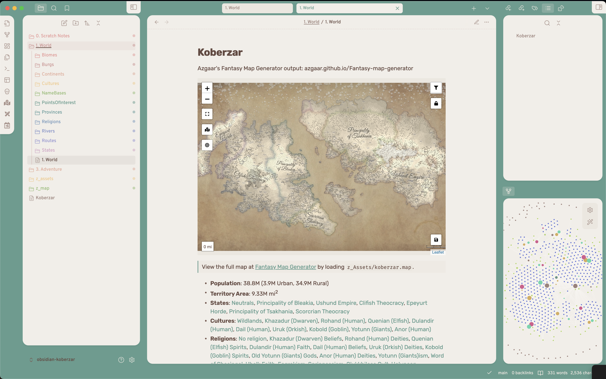

# Azgaar's Fantasy Map Generator to Obsidian Markdown

Convert a .json file from [Azgaar's Fantasy Map Generator](https://azgaar.github.io/Fantasy-Map-Generator/) to an [Obsidian.md](https://obsidian.md) Vault based on [Josh Plunkett's Obsidian for TTRPGs](https://obsidianttrpgtutorials.com).



## Getting Started

1. [Install Node.js via NVM](https://github.com/nvm-sh/nvm?tab=readme-ov-file#installing-and-updating)
2. Clone this project: `git clone https://github.com/znewton/azgaarmfg-to-obsidianmd.git`
3. Install dependencies: `npm install`
4. Build the script: `npm run build`

## Obsidian Vault Setup

The output of this script will go into a `1. World` directory based on [Josh Plunkett's Obsidian for TTRPGs - Vault Structure](https://obsidianttrpgtutorials.com/Obsidian+TTRPG+Tutorials/Getting+Started/Vault+Structure). If anything with the same file name is already included in this directory, it will be overwritten.

> **WIP:** You can add customizations that won't be overwritten when re-running this script by wrapping the customizations in a "CUSTOM" comment like so:
>
> ```md
> %% CUSTOM-START %%
> My custom additions here blah blah blah
> %% CUSTOM-END %%
> ```
> 
> Files that accept this will already contain these comments

### Obsidian Plugins

This project's output makes use of the following obsidian plugins. These are technically optional, because the output is all valid Markdown, but the viewing experience will be better if you include these.

1. [Dataview](obsidian://show-plugin?id=dataview)
    - Enables searchable, filterable tables in the Folder Note for each section.
1. [Leaflet](obsidian://show-plugin?id=obsidian-leaflet-plugin)
    - Enables viewing the map within obsidian, including linked points of interest, villages, cities, and geographical features.
1. [Folder notes](obsidian://show-plugin?id=folder-notes)
    - Enables attaching notes to folders, so that a top level description of a folder's contents can be viewed by clicking on the folder.

### Style Snippet

Skip this if the directory you output the vault to is *actually* an Obsidian vault (e.g. you created the vault then ran this, not the other way around). In that case, this will happen automatically.

1. Create a folder within `[vault]/.obsidian` called `snippets`
1. Create a file within `[vault]/.obsidian/snippets` called `afmg-to-omd.css`
1. Copy the contents of `[this-project]/src/style/snippet.css` into that file.
1. Open your vault's settings
1. Navigate to Appearance > CSS Snippets (scroll all the way down)
1. Toggle `afmg-to-omd` to "on/enabled"

> **Why?** This enables some minor style changes like causing burg/province/state emblems to float to the right of the text.

## Usage

1. Generate a fantasy map using [Azgaar's Fantasy Map Generator](https://azgaar.github.io/Fantasy-Map-Generator/)
    - Really familiarize yourself with this incredibly powerful tool ([Quick Start Guide](https://github.com/Azgaar/Fantasy-Map-Generator/wiki/Quick-Start-Tutorial))
    - **Tip**: If you have a specific genre or ✨vibe✨ you're going for, once you are happy with the baseline of the world (e.g. continents) explore regeneration options of things like states and cultures. This will let you adjust the world's peoples to match your mental image.
1. ***Important!*** Go to the "Tools" tab in the top left, then open each of the following "Edit" windows to prompt calculation of values like area and population:
    - Burgs
    - Cultures
    - Diplomacy
    - NameBases
    - Provinces (select State = All)
    - States
    - Religions
    - Routes
1. "Export" `full` JSON (saves a .json file to your Downloads folder)
1. "Save" `machine` (saves a .map file to your Downloads folder)
1. Configure a "stylistic" image of the map for visual reference (to be used within "homepage" leaflet map).
    - **Tip**: Rivers & Routes are redundant. They are included in the output of the script as interactive leaflet map features.
    - *Personally*, I like the look of the following layers: Texture, Heightmap, Relief, States, Zones, Borders, Ice, Labels, Scale Bar, and Vignette. Also, set "Options > Rendering" to Best Quality.
1. "Export" `.svg` image (size doesn't matter) with "Show all labels" checked.
1. Run `npm run convert -- --map ~/path/to/exported-map.map --json ~/path/to/exported-map.map --img ~/path/to/exported-map.svg --out ~/path/to/obsidian-vault`

```shell
# Example
npm run convert -- -j ./src/test/example/koberzar.json -m ./src/test/example/koberzar.map -i ./src/test/example/koberzar.svg -o ~/Documents/obsidian-koberzar
```
